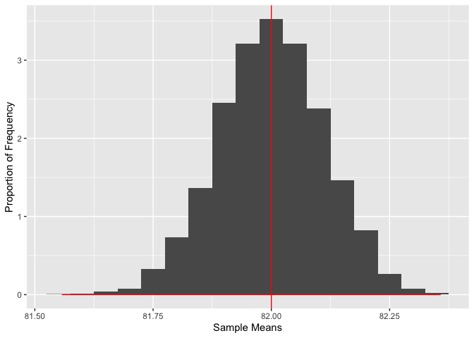
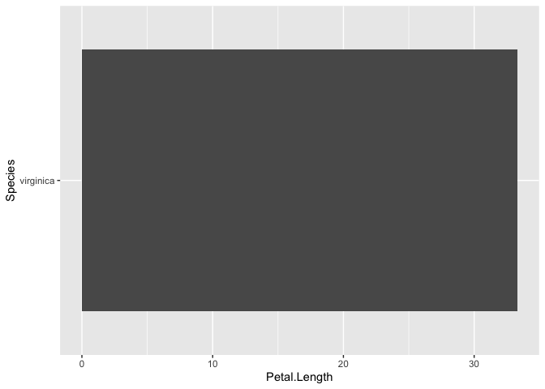

HW 3
================
SDS348 Spring 2021

## Jena Georgopulos, jg64565

**This homework is due on Feb 15, 2021 at 8am. Submit a pdf file on
Gradescope.**

*For all questions, include the R commands/functions that you used to
find your answer (show R chunk). Answers without supporting code will
not receive credit. Write full sentences to describe your findings.*

------------------------------------------------------------------------

### Question 1: (6 pts)

##### 1.1 (1 pt) Assume diastolic blood pressure is normally distributed in a certain healthy population, with a mean of 82 mmHg and a standard deviation of 11 mmHg. What proportion of this population has a diastolic blood pressure less than 60 mmHg (i.e., what is the probability that a person in this population has a diastolic blood pressure less than 60)?

``` r
pnorm(q = 60, mean = 82, sd = 11)
```

    ## [1] 0.02275013

The probability that a person in this population has a diastolic blood
pressure less than 60 mmHg is 0.02275013

##### 1.2 (1 pt) What diastolic blood pressure would put an individual from this population at the 98th percentile?

``` r
qnorm(p=0.98, mean = 82, sd= 11)
```

    ## [1] 104.5912

The diastolic blood pressure that would put an individual from this
population at the 98th percentile is 104.5912 mmHg.

##### 1.3 (1 pt) What is the probability that a random individual from this population will have a diastolic blood pressure higher than 100? (i.e., what proportion of the population has a diastolic BP greater than 100 mmHg?)

``` r
dnorm(x=100, mean=82, sd=11)
```

    ## [1] 0.009507477

The probability that a random individual from this population will have
a diastolic BP higher than 100 mmHg is 0.009507477.

##### 1.4 (1 pt) What proportion of the population has a diastolic blood pressure bewteen 80 and 90?

``` r
J = dnorm(x=80, mean=82, sd=11) + pnorm(q = 90, mean = 82, sd = 11)
mean(J)
```

    ## [1] 0.8021435

``` r
#Wasn't sure how to do this so I took my best guess. 
```

0.8021435 is the proportion of the population that has a diastolic blood
pressure between 80 mmHg and 90 mmHg.

##### 1.5 (2 pts) Assume this distribution of diastolic blood pressure is for a healthy population. If we observe an individual from an unknown population with a diastolic BP of 110 mmHg, what is the probability of observing an individual with a BP this extreme (i.e., in either direction from the mean) if the individual really came from a normal population with a mean of 82 and standard deviation of 11?

``` r
# your code goes here (make sure to add comments)
```

*Your answer goes here. 1-2 sentences.*

### Question 2: (10 pts)

##### 2.1 (1 pt) Let’s take a sample of of size 10,000 from a normal distribution with a mean of 82 and a standard deviation of 11 representing diastolic blood pressure. What is the population mean and what is the sample mean? *Note: in order to have reproducible results, set a seed with* `set.seed()`*.*

``` r
# set a seed to have reproducible results
set.seed(348)
x=rnorm(10000, 82, 11)
mean(x)
```

    ## [1] 81.67394

``` r
#above code gives the sample mean, below code gives the population mean
x=rnorm(x, 82, 11)
mean(x)
```

    ## [1] 81.96388

The sample mean is 81.67394 mmHg, and the population mean is 81.96388
mmHg.

##### 2.2 (2 pts) Using `sum()` on a logical vector, how many draws are less than 60? Using `mean()` on a logical vector, what proportion of the total draws is that? How far is your answer from `pnorm()` in 1.1 above?

``` r
set.seed(348)
x=rnorm(10000, 82, 11)
sum(ifelse(x<60,1,0))
```

    ## [1] 281

``` r
mean(x<60)
```

    ## [1] 0.0281

``` r
#not sure if this is correct, it doesn't seem right to me because the answer is so different from 1.1 
```

There are 281 draws less than 60 mmHg, which represents 0.0281 of the
total draws. This answer is 0.00534987 units away from the answer in
1.1, which was 0.02275013.

##### 2.3 (1 pt) What proportion of your sample is greater than 110 or less than 54?

``` r
set.seed(348)
x=rnorm(10000, 82, 11)
sum(ifelse(x<60,1,0))
```

    ## [1] 281

``` r
mean(x>110|x<54)
```

    ## [1] 0.012

0.012 is the proportion of the sample that is greater than 110 mmHg or
less than 54 mmHg.

##### 2.4 (1 pt) Why are your answers close to what you got above? Why are they not exactly the same?

The answers should be slightly different from the ones above because we
are taking a sample of size 10,000 from the original population and
analyzing it’s distribution.

##### 2.5 (2 pts) Using the code below, take 5 samples of size 10,000 each from a normal distribution with a mean of 82 and a standard deviation of 11. The loop will also calculate the mean for each sample. a) What is the mean of the sample means? How close is this value to the population mean? b) What is the standard deviation of the sample means? How close is this value to the population standard deviation?

``` r
# Create an empty vector to store the values of the sample means
sample_means <- numeric(0)

# Use a loop to take multiple samples and calculate the sample mean
for (i in 1:5){
  x <- rnorm(10000, 82, 11)
  sample_means <- c(sample_means,mean(x))
}
mean(sample_means)
```

    ## [1] 81.97935

``` r
sd(sample_means)
```

    ## [1] 0.1014857

The mean of the sample means is 81.97363. The standard deviation of the
sample means is 0.05185296

##### 2.6 (1 pt) Repeat question 2.5 but with 5,000 samples.

``` r
sample_means <- numeric(0)

# Use a loop to take multiple samples and calculate the sample mean
for (i in 1:5000){
  x <- rnorm(10000, 82, 11)
  sample_means <- c(sample_means,mean(x))
}
mean(sample_means)
```

    ## [1] 82.00005

``` r
sd(sample_means)
```

    ## [1] 0.1112042

##### 2.7 (2 pts) Using ggplot2, make a histogram of the sample means: set `y=..density..` inside `aes()`. Overlay a normal distribution in red with `stat_function(aes(sample_means), fun=dnorm, args=list(82,11/sqrt(10000)), color=)`. Using `geom_vline(xintercept=, color=)`, add a red line corresponding to the mean of the normal distribution and a blue line corresponding to the mean of the sample means. Label the axes appropriately. How close is the normal distribution to the distribution of the sample means?

``` r
library(ggplot2)
sample_means <- as.data.frame(sample_means)

ggplot(sample_means, mapping=aes(x= sample_means))+
  geom_histogram(aes(y=..density..), binwidth = 0.05)+
  stat_function(aes(sample_means), fun=dnorm, args = list(82/11/sqrt(1000)), color='red')+
  geom_vline(xintercept = mean(82), color="red")+
  geom_vline(xintercept = mean(sample_means), color="blue")+
  xlab("Sample Means")+ylab("Proportion of Frequency")
```



*Your answer goes here. 1-2 sentences.*

### Question 3: (9 pts)


##### The dataset `iris` contains information about the measurements (in centimeters) of sepals and petals for 50 flowers from 3 different species (see picture above). The first few observations are listed below.

``` r
library(dplyr)

# Save dataset in environment
myiris <- iris

# Look at the 10 first rows
head(iris,10)
```

    ##    Sepal.Length Sepal.Width Petal.Length Petal.Width Species
    ## 1           5.1         3.5          1.4         0.2  setosa
    ## 2           4.9         3.0          1.4         0.2  setosa
    ## 3           4.7         3.2          1.3         0.2  setosa
    ## 4           4.6         3.1          1.5         0.2  setosa
    ## 5           5.0         3.6          1.4         0.2  setosa
    ## 6           5.4         3.9          1.7         0.4  setosa
    ## 7           4.6         3.4          1.4         0.3  setosa
    ## 8           5.0         3.4          1.5         0.2  setosa
    ## 9           4.4         2.9          1.4         0.2  setosa
    ## 10          4.9         3.1          1.5         0.1  setosa

##### 3.1 (2 pts) Using `dplyr` functions (do <u>not</u> use any `[]` or `$`), show the top 5 flowers that had the highest petal length, sorted from greatest to least top length, with the variables `Species` and `Petal.Length` only. Which species had the top 5 flowers in terms of petal length?

``` r
chain1 <- myiris %>% 
  select(Species, Petal.Length) %>% 
  arrange(desc(Petal.Length))
head(chain1,5)
```

    ##     Species Petal.Length
    ## 1 virginica          6.9
    ## 2 virginica          6.7
    ## 3 virginica          6.7
    ## 4 virginica          6.6
    ## 5 virginica          6.4

In terms of petal length, the species Virginica has the top 5 flowers.

##### 3.2 (2 pts) Using `dplyr` and `ggplot2` functions (do <u>not</u> use any `[]` or `$`), construct a histogram of `Petal.Length` for the species that had the top 5 flowers with the longest petals (found in 3.1). Describe the distribution (e.g., use the words symmetric, skewed, the center is around \_, …).

``` r
chain1 %>% 
  slice(1:5) %>%
  ggplot(aes(Species,Petal.Length)) + geom_bar(stat="identity") + coord_flip()
```



*Your answer goes here. 1-2 sentences.*

##### 3.3 (1 pt) Using `dplyr` functions (do <u>not</u> use any `[]` or `$`), are there any cases in the dataset for which the ratio of sepal length to sepal width exceeds the ratio of petal length to petal width?

``` r
# your code goes here (make sure to add comments)
```

*Your answer goes here. 1-2 sentences.*

##### 3.4 (2 pts) Using `dplyr` functions (do <u>not</u> use any `[]` or `$`), create a new variable `petal_ratio` as the ratio of petal length to petal width then calculate the mean and standard deviation of this ratio for each species. Based on these summary statistics, does `petal_ratio` seem to differ across species? *No need to conduct hypothesis testing but informally state if they seem to differ and if so, how.*

``` r
# your code goes here (make sure to add comments)
```

*Your answer goes here. 1-2 sentences.*

##### 3.5 (2 pts) Using `dplyr` and `ggplot2` functions (do <u>not</u> use any `[]` or `$`), create a new variable `sepal_ratio` as the ratio of sepal length to sepal width then construct boxplots representing `sepal_ratio` for each species. Based on these visualizations, does `sepal_ratio` seem to differ across species? *No need to conduct hypothesis testing but informally state if they seem to differ and if so, how.*

``` r
# your code goes here (make sure to add comments)
```

*Your answer goes here. 1-2 sentences.*

------------------------------------------------------------------------

    ##                                                                                            sysname 
    ##                                                                                           "Darwin" 
    ##                                                                                            release 
    ##                                                                                           "19.6.0" 
    ##                                                                                            version 
    ## "Darwin Kernel Version 19.6.0: Mon Aug 31 22:12:52 PDT 2020; root:xnu-6153.141.2~1/RELEASE_X86_64" 
    ##                                                                                           nodename 
    ##                                                                         "Peters-MacBook-Air.local" 
    ##                                                                                            machine 
    ##                                                                                           "x86_64" 
    ##                                                                                              login 
    ##                                                                                             "root" 
    ##                                                                                               user 
    ##                                                                                      "georgopulos" 
    ##                                                                                     effective_user 
    ##                                                                                      "georgopulos"
